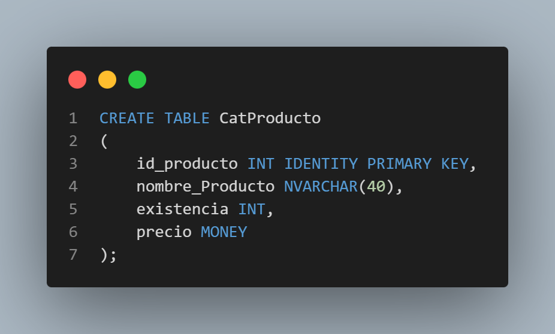
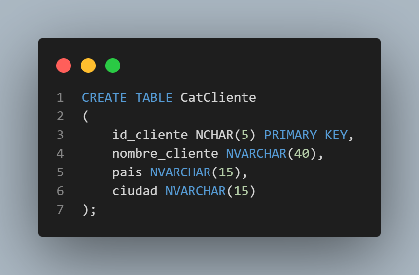
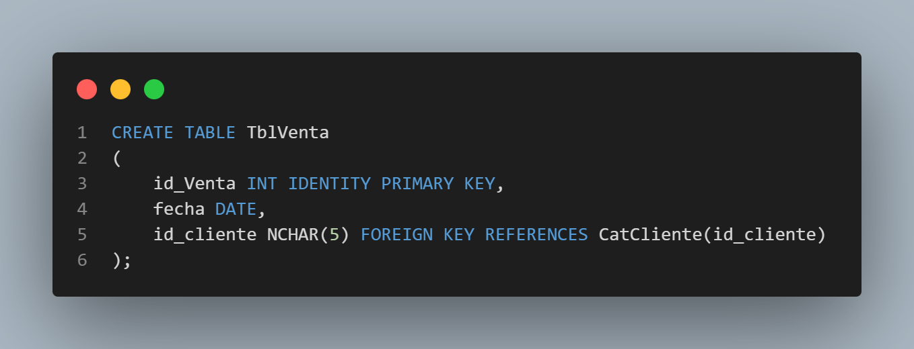
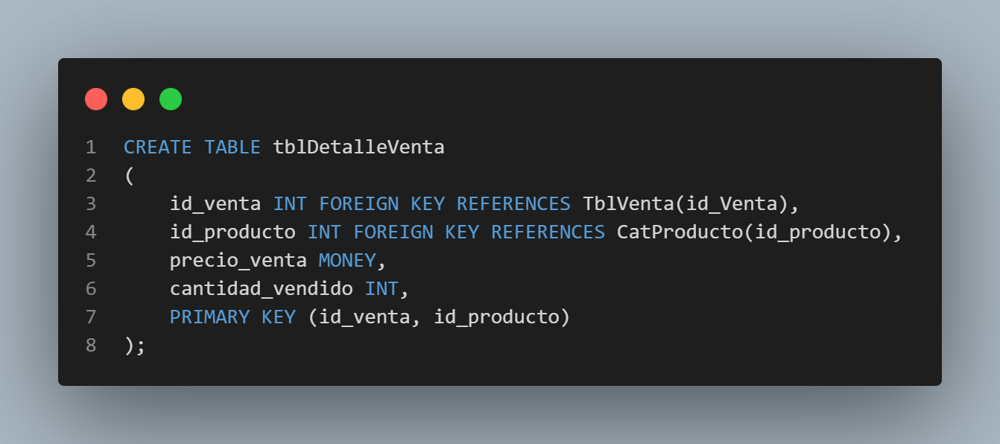
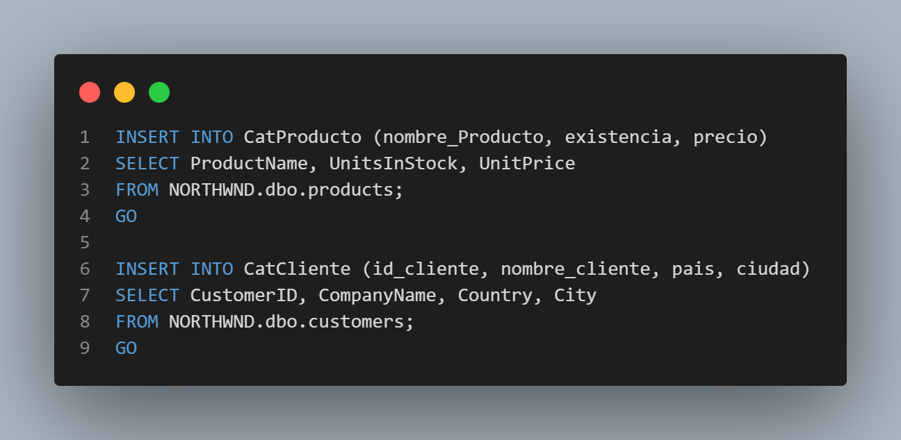
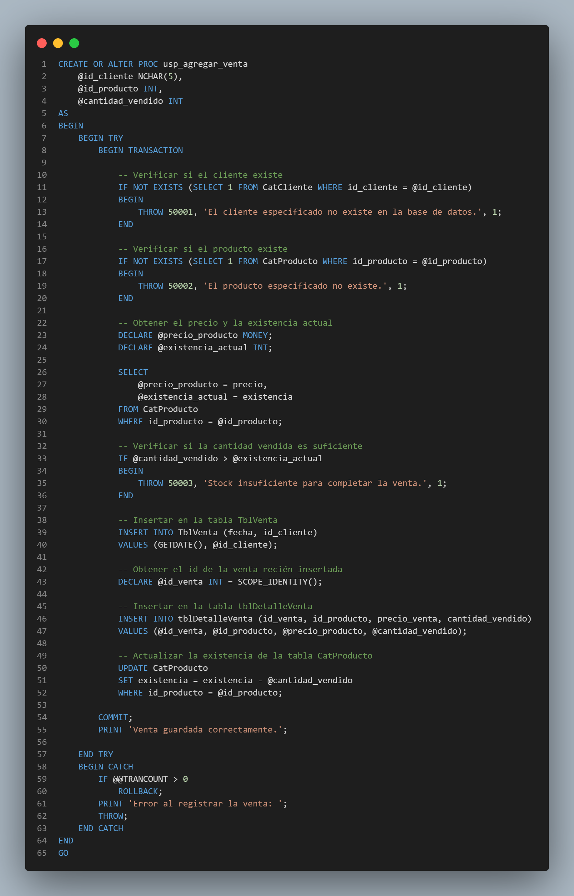
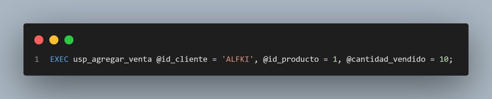

# Documentación de Práctica: Store Procedures y Control de Inventario

Esta práctica consistió en la creación de una base de datos denominada `bdpracticas`, la migración de datos desde la base de datos `NORTHWND` y la implementación de un procedimiento almacenado para la gestión de ventas con validaciones de existencia y transacciones.

## 1. Diseño de la Base de Datos

Se definieron cuatro tablas principales siguiendo un modelo de catálogo-movimiento.

### Tablas de Catálogo
* **CatProducto**: Almacena información sobre los productos, incluyendo stock y precio unitario.



* **CatCliente**: Almacena los datos de identificación y ubicación de los clientes.



### Tablas de Movimiento (Ventas)
* **TblVenta**: Registro maestro de la venta (Cabecera), incluyendo fecha y cliente.



* **tblDetalleVenta**: Registro detallado de los productos vendidos en cada transacción.



---

## 2. Implementación de SQL

### Creación de Objetos
El script inicial crea la base de datos y define las relaciones mediante llaves primarias (`PK`) y foráneas (`FK`) para asegurar la integridad referencial.

### Carga de Datos (ETL Local)
Se realizó una inserción masiva desde `NORTHWND.dbo.products` y `NORTHWND.dbo.customers` para poblar los catálogos iniciales:
* Los productos se mapearon de `ProductName`, `UnitsInStock` y `UnitPrice`.
* Los clientes se mapearon de `CustomerID`, `CompanyName`, `Country` y `City`.



---

## 3. Store Procedure `usp_agregar_venta`

El corazón de la solución es el Store Procedure `usp_agregar_venta`. Este procedimiento garantiza que:

1.  **Validación de Identidad**: Se verifica que tanto el cliente como el producto existan antes de proceder.
2.  **Control de Stock**: Se consulta la existencia actual y se compara con la cantidad solicitada. Si no hay suficiente, la transacción se detiene mediante un `THROW`.
3.  **Atomicidad (Transacciones)**: Se utiliza `BEGIN TRANSACTION` y `COMMIT`. Si algo falla (por ejemplo, falta de stock), se ejecuta un `ROLLBACK` para evitar datos inconsistentes.
4.  **Automatización de Cálculos**: 
    * La fecha se captura automáticamente con `GETDATE()`.
    * El precio de venta se obtiene directamente del catálogo actual.
    * Se utiliza `SCOPE_IDENTITY()` para vincular el detalle de la venta con la cabecera recién creada.
5.  **Actualización de Inventario**: Al finalizar la venta, se resta automáticamente la cantidad vendida de la tabla `CatProducto`.



## Ejecución del Store Procedure

Se ejecutó el procedimiento almacenado `usp_agregar_venta` con los siguientes parámetros:

- `@id_cliente = 'ALFKI'`
- `@id_producto = 1`
- `@cantidad_vendido = 10`



Después de la ejecución, se verificaron las tablas `TblVenta`, `tblDetalleVenta` y `CatProducto` para confirmar que la venta se registró correctamente y que la existencia del producto se actualizó adecuadamente.

---

## 4. Comandos de Git para el Despliegue

Para finalizar el flujo de trabajo en el repositorio, se deben ejecutar los siguientes comandos en la terminal:

```bash
# 1. Crear una rama para la práctica (opcional pero recomendado)
git checkout -b feature/practica-sp

# 2. Agregar el archivo de documentación y el script SQL
git add .

# 3. Crear el commit solicitado
git commit -m "Practica venta en Store Procedure"

# 4. Integrar con la rama principal
git checkout main
git merge feature/practica-sp

# 5. Subir cambios a GitHub
git push origin main
```
---
