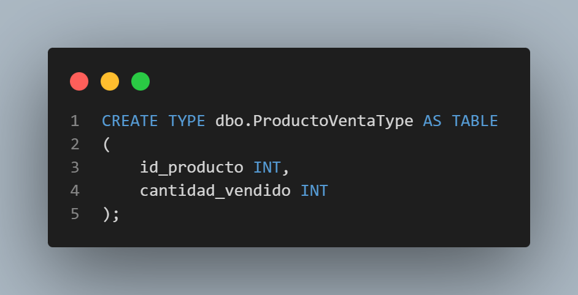
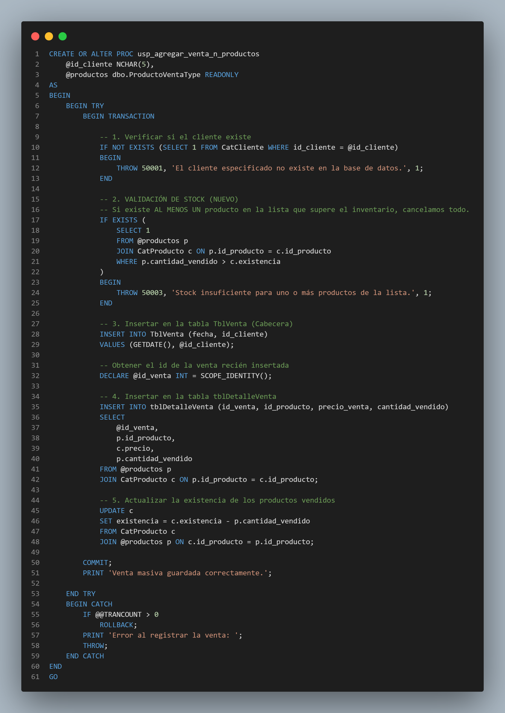
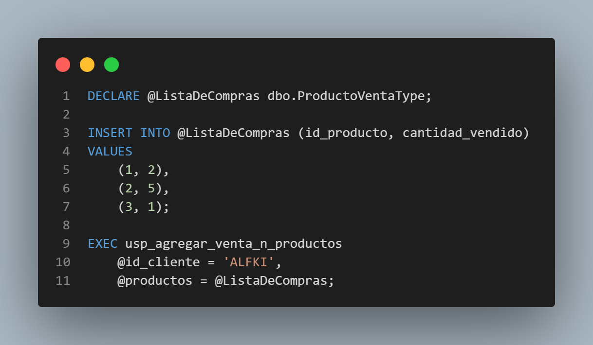

# Documentación: Evolución a Ventas Multi-Producto

En esta fase de la práctica, se optimizó el sistema para permitir que una sola venta registre múltiples artículos simultáneamente.
## 1. Implementación de Table-Valued Parameters

Para enviar una lista de productos como parámetro a un Store Procedure, se creó un tipo de tabla definido por el usuario:



### Ventajas de este enfoque:
* **Encapsulamiento:** Permite pasar estructuras complejas de datos en un solo parámetro.
* **Eficiencia:** Reduce el tráfico de red al procesar "N" productos en un solo bloque de código.
* **Seguridad:** Al ser `READONLY` dentro del procedimiento, se garantiza que la fuente de datos original no sea alterada accidentalmente.

---

## 2. Lógica del Store Procedure: `usp_agregar_venta_n_productos`

El procedimiento fue rediseñado para manejar operaciones de conjunto en lugar de valores individuales.

### Flujo de Ejecución:
1.  **Validación de Integridad**: Comprueba la existencia del cliente mediante `IF NOT EXISTS`.
2.  **Validación de Stock Masiva**: Utiliza un `EXISTS` con un `JOIN` entre el parámetro `@productos` y el catálogo `CatProducto`. Si **un solo producto** de la lista supera el stock disponible, se lanza una excepción y se cancela todo el proceso.
3.  **Inserción de Cabecera**: Se crea el registro en `TblVenta` una sola vez.
4.  **Inserción de Detalle (Bulk Insert)**: Se insertan todos los productos de la lista en `tblDetalleVenta` usando un `INSERT INTO ... SELECT` que obtiene los precios vigentes del catálogo automáticamente.
5.  **Actualización de Inventario**: Se realiza un `UPDATE` con `JOIN` para descontar el stock de todos los productos involucrados en un solo paso.



---

## 3. Ejemplo de Uso

Para probar esta funcionalidad, se declara una variable del tipo creado anteriormente, se llena con los datos de prueba y se ejecuta el procedimiento:



---

## 4. Pasos para Git (Continuación)

Para finalizar el flujo de trabajo en el repositorio, se deben ejecutar los siguientes comandos en la terminal:

```bash

# 1. Agregar el archivo de documentación y el script SQL
git add .

# 2. Crear el commit
git commit -m "Practica venta en Store Procedure 2"

# 3. Integrar con la rama principal
git checkout main
git merge practica-sp

# 4. Subir cambios a GitHub
git push origin main
```

---
